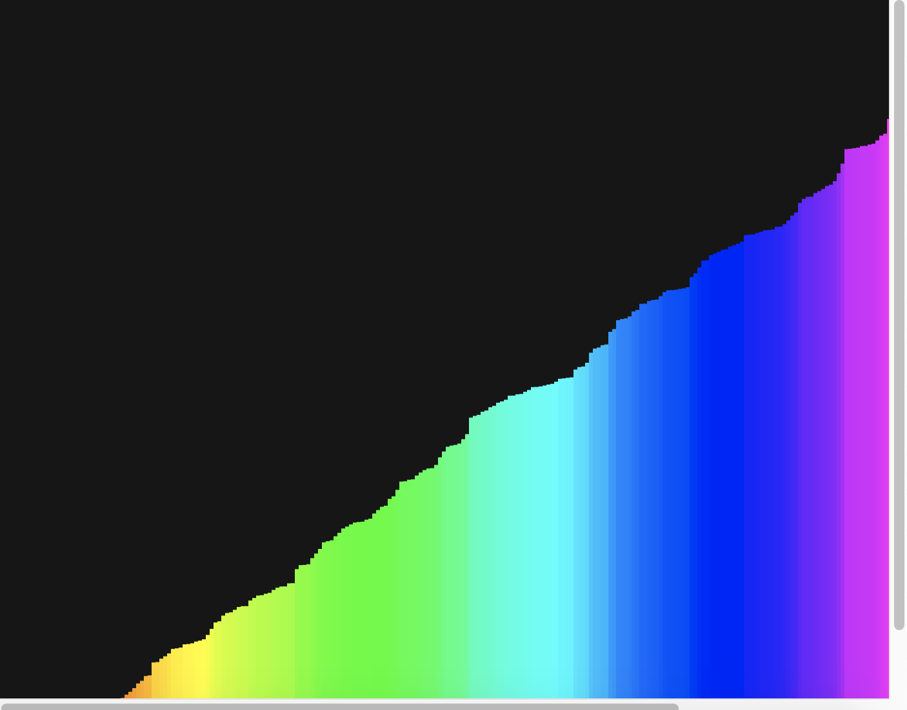

# Greed-DivideToConquer

**Número da Lista**: 3
**Conteúdo da Disciplina**: Greed

## Alunos
|Matrícula | Aluno |
| -- | -- |
| 17/0039668  |  Lucas Ganda Carvalho  |
| 17/0047326  |  Wictor Bastos Girardi |

## Sobre 
O Projeto consiste na visualização do algoritmo de Dividir para conquistar, onde durante a execução do projeto um array é ordenado de forma visual para o usuário.

## Screenshots

## Execução
Entre no site https://editor.p5js.org/ e copie o código fonte para a execução do projeto.
